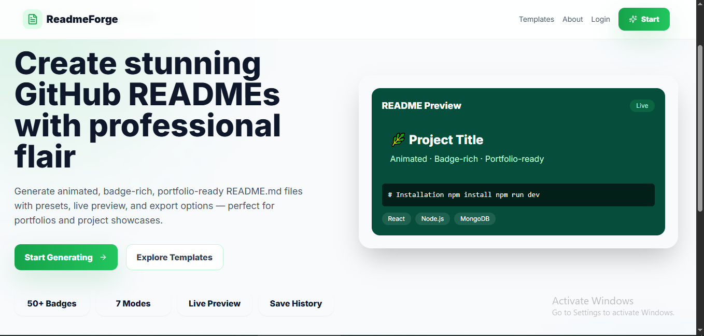
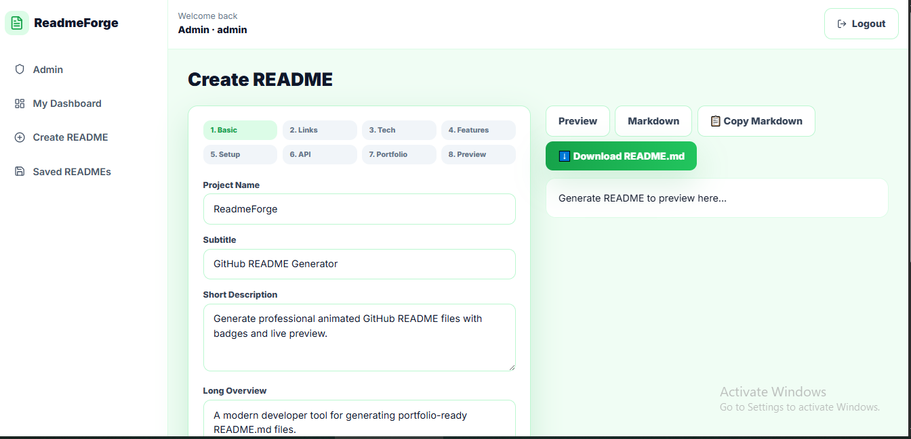

````markdown
<div align="center">

# 🌿 ReadmeForge  
### ✨ GitHub README Generator


<br/>


<br/>


<br/>

### 🚀 Create professional, animated, badge-rich GitHub README.md files in minutes.

**A green-themed MERN developer tool with live markdown preview, README templates, copy/download actions, saved history, strong validations, and a beautiful SaaS dashboard UI.**

<br/>


</div>

---

## 📸 Project Preview

<div align="center">

### 🌿 Landing Page



<br/>
<br/>

### 📝 README Generator Dashboard



</div>

---

## 🌟 Overview

**ReadmeForge** is a modern **green-themed GitHub README generator** built with the **MERN stack**. It helps developers generate professional, animated, badge-rich, portfolio-ready `README.md` files without manually writing markdown from scratch.

Users can enter project information, select tech stacks, add features, commands, environment variables, API endpoints, folder structure, screenshots, author links, CV bullets, and interview explanations. The app instantly generates a polished README with a live preview, copy button, download button, and saved README history.

---

## 🎯 Project Purpose

| Target Area | What This Project Demonstrates |
|---|---|
| 💻 Full Stack Development | React, Node.js, Express, MongoDB, REST APIs |
| 🎨 Frontend Engineering | Green SaaS UI, responsive layouts, reusable components |
| ⚙️ Backend Engineering | JWT auth, validation, protected APIs, clean architecture |
| 🧠 Developer Tooling | Markdown generation, badge generation, README templates |
| 📊 Dashboard UI | Analytics cards, saved history, admin view |
| 🧑‍💼 Portfolio Value | Practical tool that helps create better GitHub project documentation |

---

## ✨ Key Features

### 🧙 README Generator

- 📝 Step-based README creation wizard
- 🌿 Beautiful green-themed interface
- 🏷️ Badge generator for popular technologies
- ✨ Animated typing SVG header generation
- 🌊 Capsule render wave animation support
- 📸 Project screenshot preview section
- 🧰 Tech stack table generator
- 📁 Folder structure code block generator
- ⚙️ Environment variable section generator
- 🔌 API endpoint section generator
- 📌 CV bullet generator
- 🎤 Interview explanation generator

---

### 👀 Markdown Preview & Export

- 👀 Live markdown preview
- 📋 Copy markdown button
- ⬇️ Download `README.md`
- 🔄 Regenerate README instantly
- 🧪 Preview before saving
- ✅ User-friendly success/error messages

---

### 💾 Saved README History

- 💾 Save generated README files
- ⭐ Mark favorite READMEs
- 🔁 Duplicate existing README
- ✏️ Edit saved README data
- 🗑️ Delete saved README
- 🔎 Search saved READMEs
- 🗂️ Filter by category/style
- 📊 View dashboard statistics

---

### 🔐 Authentication & Admin

- 🔐 JWT authentication
- 🔒 bcrypt password hashing
- 👤 User dashboard
- 🛡️ Admin dashboard
- 👑 Default admin seed account
- 🚪 Logout support
- 🧾 Protected routes
- ✅ Ownership validation for saved READMEs

---

## 🧰 Tech Stack

| Layer | Technology |
|---|---|
| 🎨 Frontend | React, Vite |
| 💅 Styling | Tailwind CSS |
| 🧭 Routing | React Router |
| 🔗 API Client | Axios |
| 📝 Markdown Preview | React Markdown |
| 📊 Charts | Recharts |
| 🎯 Icons | Lucide React |
| 🔔 Toast Messages | React Toastify |
| ⚙️ Backend | Node.js, Express.js |
| 🗄️ Database | MongoDB, Mongoose |
| 🔐 Authentication | JWT, bcryptjs |
| ✅ Validation | express-validator |
| 🛡️ Security | Helmet, CORS, express-rate-limit |
| 🐳 Database Runtime | Docker Compose |

---

## 🏗️ System Architecture

```text
┌──────────────────────────────┐
│        React Frontend         │
│  Vite + Tailwind + Preview    │
└───────────────┬──────────────┘
                │
                │ REST API + JWT
                ▼
┌──────────────────────────────┐
│       Express.js Backend      │
│ Auth + README Generator APIs  │
└───────────────┬──────────────┘
                │
                │ Mongoose ODM
                ▼
┌──────────────────────────────┐
│           MongoDB             │
│ Users / READMEs / Templates   │
└──────────────────────────────┘
````

---

## 🗄️ Database Models

```text
User
 ├── name
 ├── email
 ├── password
 ├── role
 └── avatar

ReadmeProject
 ├── projectName
 ├── description
 ├── repositoryName
 ├── techStack
 ├── features
 ├── environmentVariables
 ├── apiEndpoints
 ├── folderStructure
 ├── generatedMarkdown
 ├── isFavorite
 └── user

Template
 ├── name
 ├── description
 ├── category
 ├── styleOption
 └── structure
```

---

## 📁 Project Structure

```text
readmeforge-github-readme-generator/
├── frontend/
│   ├── src/
│   │   ├── components/
│   │   ├── context/
│   │   ├── pages/
│   │   ├── services/
│   │   ├── utils/
│   │   ├── App.jsx
│   │   ├── main.jsx
│   │   └── index.css
│   ├── package.json
│   ├── .env.example
│   ├── index.html
│   ├── vite.config.js
│   ├── tailwind.config.js
│   └── postcss.config.js
│
├── backend/
│   ├── src/
│   │   ├── config/
│   │   ├── controllers/
│   │   ├── middleware/
│   │   ├── models/
│   │   ├── routes/
│   │   ├── services/
│   │   ├── utils/
│   │   ├── validators/
│   │   ├── app.js
│   │   └── server.js
│   ├── package.json
│   └── .env.example
│
├── docs/
│   ├── API_DOCUMENTATION.md
│   ├── DATABASE_SCHEMA.md
│   ├── SYSTEM_ARCHITECTURE.md
│   └── README_GENERATION_LOGIC.md
│
├── screenshots/
│   ├── Landing.PNG
│   └── README.PNG
│
├── docker-compose.yml
├── README.md
└── .gitignore
```

---

## ⚙️ Environment Variables

### Backend `.env`

```env
PORT=5000
MONGO_URI=mongodb://localhost:27017/readmeforge
JWT_SECRET=change_this_secret
CLIENT_URL=http://localhost:5173
ADMIN_EMAIL=admin@example.com
ADMIN_PASSWORD=Admin12345
```

### Frontend `.env`

```env
VITE_API_URL=http://localhost:5000/api
```

---

## 🧑‍💻 Run Locally

### 1️⃣ Start MongoDB

```bash
docker compose up -d mongo
```

---

### 2️⃣ Start Backend

```bash
cd backend
npm install
copy .env.example .env
npm run dev
```

Backend URL:

```text
http://localhost:5000
```

---

### 3️⃣ Start Frontend

```bash
cd frontend
npm install
copy .env.example .env
npm run dev
```

Frontend URL:

```text
http://localhost:5173
```

---

## 🔑 Demo Admin Account

```text
Email:    admin@example.com
Password: Admin12345
```

---

## 🔌 API Endpoints

### 🔐 Auth

```text
POST /api/auth/register
POST /api/auth/login
GET  /api/auth/me
PUT  /api/auth/profile
PUT  /api/auth/change-password
```

### 📝 README

```text
POST   /api/readmes/generate
POST   /api/readmes
GET    /api/readmes
GET    /api/readmes/:id
PUT    /api/readmes/:id
DELETE /api/readmes/:id
PUT    /api/readmes/:id/favorite
POST   /api/readmes/:id/duplicate
```

### 🧩 Templates

```text
GET /api/templates
GET /api/templates/:id
```

### 📊 Dashboard

```text
GET /api/dashboard/stats
```

### 🛡️ Admin

```text
GET /api/admin/users
GET /api/admin/readmes
GET /api/admin/stats
```

---

## ✅ Validation Features

### Frontend Validations

* ✅ Project name required
* ✅ Short description required
* ✅ Repository name kebab-case validation
* ✅ Valid URL validation
* ✅ Screenshot path image extension validation
* ✅ Tech stack required
* ✅ Duplicate tech stack prevention
* ✅ Feature title validation
* ✅ Environment key uppercase snake-case validation
* ✅ API endpoint path must start with `/`
* ✅ Duplicate API endpoint prevention
* ✅ Friendly toast messages

### Backend Validations

* ✅ Register/login validation
* ✅ Email uniqueness check
* ✅ Password strength validation
* ✅ JWT token validation
* ✅ README generate request validation
* ✅ User ownership validation
* ✅ Admin-only route protection
* ✅ Clean JSON error responses
* ✅ Rate limiting for auth/generator APIs

---

## 🛡️ Security Features

* 🔐 JWT authentication
* 🔒 bcrypt password hashing
* 🛡️ Helmet security headers
* 🌐 CORS protection
* 🚦 API rate limiting
* ✅ express-validator validation layer
* 👤 User ownership checks
* 👑 Admin route protection
* 🚫 Password hidden from responses
* 🧼 Clean error handling

---

## 🧪 Test Flow

### User Flow

```text
1. Register or login
2. Open Create README page
3. Fill project details
4. Select tech stack
5. Add features and commands
6. Generate README
7. Preview markdown
8. Copy or download README.md
9. Save generated README
10. View saved README history
```

### Admin Flow

```text
1. Login as admin
2. Open admin dashboard
3. View total users
4. View total generated README documents
5. Monitor project usage statistics
```

---

## 📊 Dashboard Highlights

| Dashboard Area    | Details                             |
| ----------------- | ----------------------------------- |
| 📄 Total READMEs  | Count of generated README documents |
| ⭐ Favorites       | Favorite saved README count         |
| 🧰 Most Used Tech | Most selected technology            |
| 🧙 README Modes   | README style/mode usage             |
| 📈 Charts         | Category and style analytics        |
| 🕘 Recent READMEs | Recently generated README files     |

---

## 🧩 Future Improvements

* 🤖 AI-powered README improvement
* 🔐 GitHub OAuth login
* 📦 Import project details from GitHub repository URL
* 🧠 Auto-detect tech stack from `package.json`
* 📊 README score checker
* 🎨 Multiple README export styles
* 🚀 GitHub direct commit integration
* 👥 Team workspace
* ☁️ Cloud sync
* 🧩 Template marketplace
* 🌙 Dark mode editor
* 🧱 Drag-and-drop README section builder

---

## 🎤 Interview Explanation

> ReadmeForge is a MERN-based developer tool that generates professional GitHub README files. It includes JWT authentication, a green-themed React dashboard, a step-based README generator wizard, markdown preview, badge generation, saved README history, and backend validation. The project demonstrates full-stack architecture, reusable UI components, secure APIs, and practical developer tooling.

---

## 👨‍💻 Author

<div align="center">

**Lithira Liyanage**
Full Stack Developer | MERN Stack Developer | AI Engineer

[](https://github.com/LithiraLiyanage)
[](https://www.linkedin.com/in/lithira-liyanage-667b99403)
[](https://lithira-liyanage.vercel.app/)

</div>

---

<div align="center">

### ⭐ If this project helps you, give it a star!


<br/>


</div>
```

